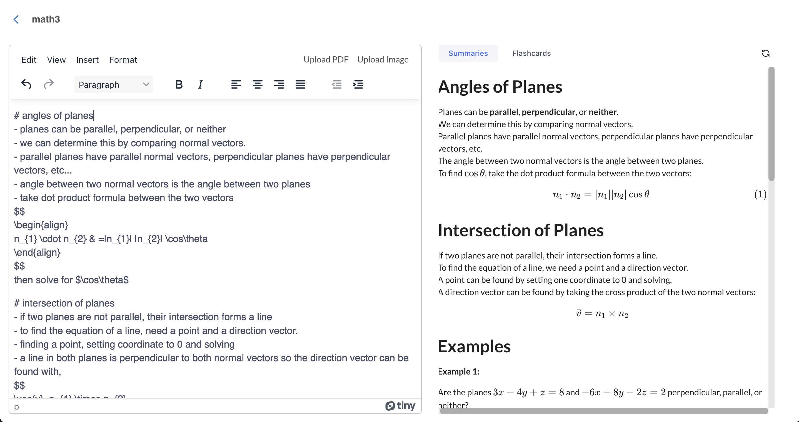

<!-- Improved compatibility of back to top link: See: https://github.com/othneildrew/Best-README-Template/pull/73 -->
<!--
*** Thanks for checking out the Best-README-Template. If you have a suggestion
*** that would make this better, please fork the repo and create a pull request
*** or simply open an issue with the tag "enhancement".
*** Don't forget to give the project a star!
*** Thanks again! Now go create something AMAZING! :D
-->

<!-- PROJECT SHIELDS -->
<!--
*** I'm using markdown "reference style" links for readability.
*** Reference links are enclosed in brackets [ ] instead of parentheses ( ).
*** See the bottom of this document for the declaration of the reference variables
*** for contributors-url, forks-url, etc. This is an optional, concise syntax you may use.
*** https://www.markdownguide.org/basic-syntax/#reference-style-links
-->

<!-- ABOUT THE PROJECT -->
## Everest

Studying with your own notes may end up being inefficient because you may not know what topics are important or related to each other. This lack of clarity often leads to information overload and struggles with retention. Our inspiration stems from the need to simplify the learning process, making it easier to identify key information and relationships between topics.

Everest is a modern note-taking / study app with three main features:
- Quickly summarizing notes using AI
- Generating flashcards with AI
- Uploading PDF and image files so you can upload raw lecture slides or handwritten notes.

## Technologies Used
- MongoDB Atlas
- Google Cloud
- Next.js
- Typescript
- tRPC
- Google PaLM 2
- Google Vision AI
- Uploadthing

<!-- GETTING STARTED -->

